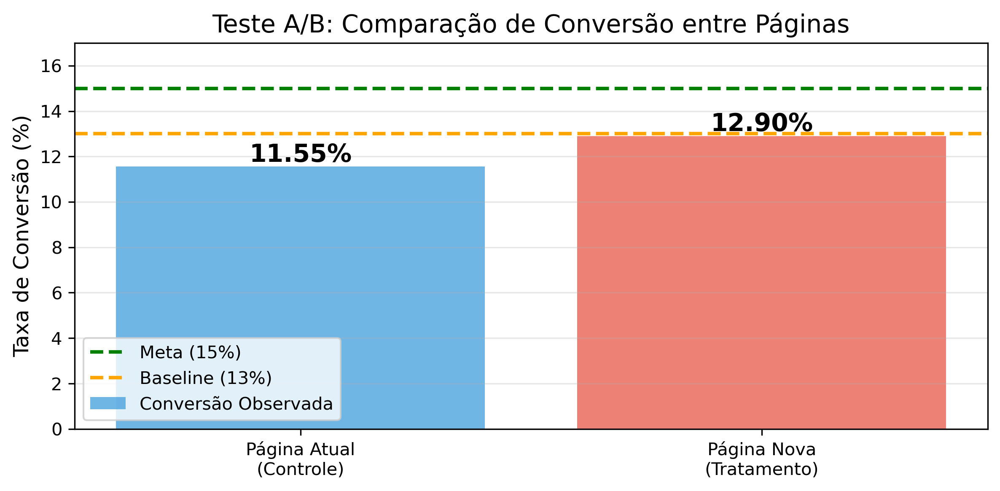
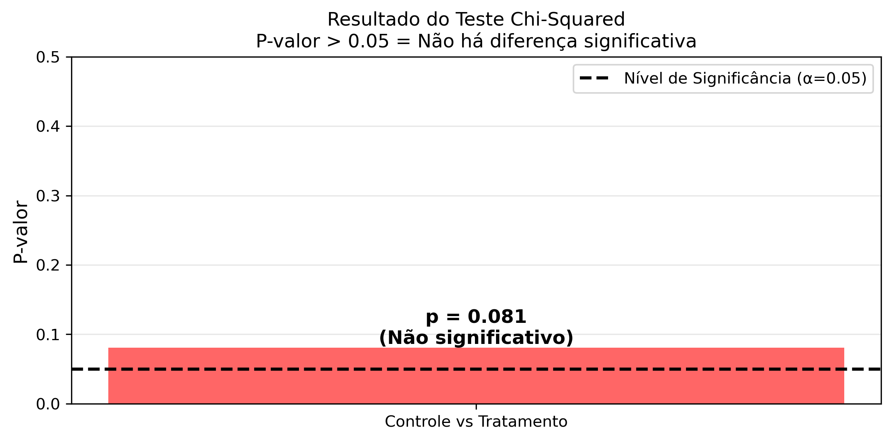
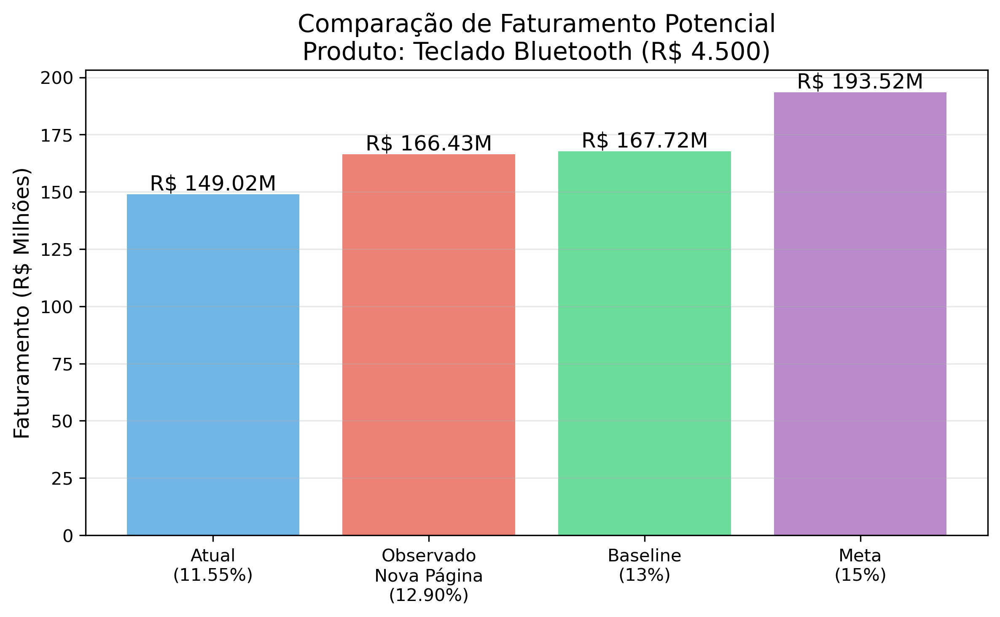
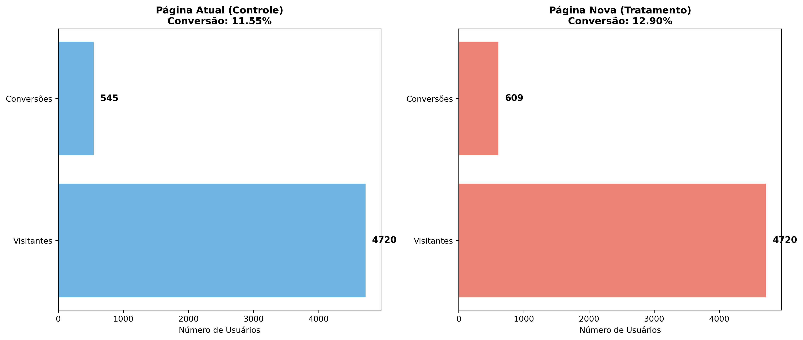

TESTE A/B - ELECTRONIC HOUSE
================================================
Projeto: Validação Estatística de Nova Página de Vendas  
Produto: Teclado Bluetooth (R$ 4.500)  
Data: Fevereiro/Março 2025  
Dataset: Kaggle  
================================================

## Índice

- [Objetivo do Projeto](https://github.com/leandraresende/ab-testing-ecommerce?tab=readme-ov-file#objetivo-do-projeto)
- [Resultados Principais](https://github.com/leandraresende/ab-testing-ecommerce#resultados-principais)
- [Contexto de Negócio](https://github.com/leandraresende/ab-testing-ecommerce#contexto-de-neg%C3%B3cio)
- [Metodologia](https://github.com/leandraresende/ab-testing-ecommerce#metodologia)
- [Tecnologias Utilizadas](https://github.com/leandraresende/ab-testing-ecommerce#tecnologias-utilizadas)
- [Análise Estatística](https://github.com/leandraresende/ab-testing-ecommerce#an%C3%A1lise-estat%C3%ADstica-detalhada)
- [Insights e Recomendações](https://github.com/leandraresende/ab-testing-ecommerce#insights-e-recomenda%C3%A7%C3%B5es)
- [Visualizações Gráficas](https://github.com/leandraresende/ab-testing-ecommerce#visualiza%C3%A7%C3%B5es-gr%C3%A1ficas)
- [Aprendizados do Projeto](https://github.com/leandraresende/ab-testing-ecommerce#aprendizados-do-projeto)

---
## Objetivo do Projeto

**Contexto:** A Electronic House, e-commerce de produtos de informática, desenvolveu uma nova landing page para seu produto principal: um teclado bluetooth de R$4.500.

**Desafio:** Validar estatisticamente se a nova página atinge a meta de 15% de conversão (aumento de 2 pontos percentuais sobre a baseline de 13%).

**Solução:** Condução de teste A/B rigoroso com 9.440 usuários (4.720 por grupo) utilizando teste Chi-Squared para comparação de proporções, cálculo de significância estatística e projeção de impacto financeiro.

**Entregáveis:**
1. Validação estatística da efetividade da nova página
2. Projeção de vendas incrementais potenciais
3. Cálculo de impacto no faturamento
4. Recomendação fundamentada em dados

---
## Resultados Principais

### CONCLUSÃO: Nova página NÃO apresentou melhoria

| Métrica | Grupo Controle (Old Page) | Grupo Tratamento (New Page) |
|---------|---------------------------|----------------------------|
| **Usuários na amostra** | 4.720 | 4.720 |
| **Conversões** | 545 | 609 |
| **Taxa de Conversão** | 11.55% | 12.90% |
| **Status vs Baseline (13%)** | Abaixo | Abaixo |
| **Status vs Meta (15%)** | 3.45 pp abaixo | 2.10 pp abaixo |

### Teste Estatístico

| Parâmetro | Valor |
|-----------|-------|
| **Método** | Chi-Squared Test |
| **P-valor** | 0.0806 |
| **Nível de significância (α)** | 0.05 |
| **Resultado** | Não significativo (p > 0.05) |
| **Conclusão** | Não há evidência estatística de diferença entre as páginas |

### Impacto Financeiro Projetado (Se meta fosse atingida)

| Cenário | Conversão | Vendas/Período | Faturamento |
|---------|-----------|----------------|-------------|
| **Atual (baseline)** | 13% | 37.271 unidades | R$ 167.719.500 |
| **Observado (new page)** | 12.90% | 36.984 unidades* | R$ 166.428.059,85* |
| **Meta almejada** | 15% | 43.004 unidades | R$ 193.518.000 |
| **Ganho potencial** | +2 pp | +5.733 unidades | +R$ 25.798.500 |
| **Lift esperado** | +15.38% | +15.38% | +15.38% |

*_Projeção baseada na conversão observada no tratamento_

### Insight Principal

A nova página desenvolvida pelo time de UX **não atingiu a meta de 15%**, bem como apresentou conversão inferior à baseline atual (12.90% vs 13%), com **diferença não significativa** estatisticamente.

**Recomendação:** **NÃO implementar** a nova página. Realizar pesquisa qualitativa com usuários para identificar pontos de fricção antes de novo teste.

---
## Contexto de negócio:
A Electronic House é um e-commerce de produtos de informática para casas e escritórios, vendendo periféricos (mouses, teclados, webcams), monitores e acessórios, computadores e laptops, cabos e conectores.  

O time de UX designers vem trabalhando em uma nova página de vendas para um teclado bluetooth (preço de venda de R$4.500,00), com o objetivo de aumentar a taxa de conversão histórica de 13% para 15%.  

Os entregáveis do trabalho são os seguintes:  
    1. A conversão da nova página é realmente melhor do a conversão da página atual?  
    2. Qual o potencial de número de vendas que a nova página pode trazer?  
    3. Qual o faturamento total na venda do teclado bluetooth através da nova página?  
    
O conjunto de dados está disponível na plataforma do Kaggle, através desse link: https://www.kaggle.com/datasets/zhangluyuan/ab-testing?select=ab_data.csv 

---
## Metodologia

### 1. Design do Experimento

**Tipo de Teste:** A/B Test (Two-Sample Proportion Test)

**Hipóteses:**
- H₀ (Nula): p_tratamento = p_controle (não há diferença nas conversões)
- H₁ (Alternativa): p_tratamento ≠ p_controle (há diferença nas conversões)

**Parâmetros:**
- Nível de confiança: 95%
- Nível de significância α = 0.05
- Tipo de teste: Two-tailed (bilateral)
- Métrica de sucesso: Taxa de conversão (%), definida como número de visitantes por número de compradores.

### 2. Estrutura dos Grupos

**Grupo Controle:**
- Página: Old page (atual)
- Tamanho: 4.720 usuários
- Randomização: Aleatória simples

**Grupo Tratamento:**
- Página: New page (UX redesign)
- Tamanho: 4.720 usuários
- Randomização: Aleatória simples

**Total:** 9.440 usuários (subset do dataset completo de 286.690)

### 3. Preparação dos Dados

**Limpeza aplicada:**
1. Remoção de usuários duplicados entre grupos
2. Validação de flags (consistência group vs landing_page )
3. Verificação de valores ausentes
4. Validação de tipos de dados

### 4. Análise Estatística

**Método:** Teste Chi-Squared
- Adequado para comparação de proporções
- Não assume normalidade
- Requer amostras grandes

**Cálculo de Conversões:**
Conversão_controle = 545 / 4720 = 11.55%
Conversão_tratamento = 609 / 4720 = 12.90%

**Resultado do Teste:**
P-valor = 0.0806

**Interpretação:**
- P-valor (0.0806) > α (0.05)
- Não rejeita H₀ (hipótese nula)
- Conclusão: Não há diferença estatística significativa entre as páginas

### 5. Cálculo de Impacto de Negócio

**Projeção de Vendas:**

- Cenário atual (baseline 13%)  
vendas_atuais = total_usuarios * 0.13 = 37.271 unidades

- Cenário meta (15%)  
vendas_meta = total_usuarios * 0.15 = 43.004 unidades

- Aumento potencial  
delta = 5.733 unidades  
lift = 15.38%

**Projeção de Faturamento:**

- Preço unitário  
preco = R$ 4.500

- Faturamento atual  
fat_atual = 37.271 * 4.500 = R$ 167.719.500

- Faturamento meta  
fat_meta = 43.004 * 4.500 = R$ 193.518.000

- Receita incremental potencial  
delta_receita = R$ 25.798.500

---
## Tecnologias Utilizadas

- **Python 3.12**
- **Jupyter Notebook**
- **Pandas e Numpy:** manipulação dos dados
- **SciPy** - Chi-Squared Test, testes de hipóteses
- **Statsmodels** - tamanho das amostras, testes estatísticos
- **Matplotlib e Seaborn:** visualização

---
## Análise Estatística Detalhada

### Premissas do Teste

**Premissas verificadas:**
Independência: Usuários únicos, sem sobreposição entre grupos
Randomização: Amostragem aleatória simples aplicada
Tamanho amostral: n=4.720 por grupo

### Tamanho da amostra

**Parâmetros para cálculo de amostra necessária:**
- Conversão baseline (p1): 13%
- Conversão esperada (p2): 15%
- Efeito mínimo detectável: 2 pontos percentuais
- Poder do teste (1-β): 80%
- Nível de significância (α): 5%

**Resultado:** 4.720 usuários por grupo são suficientes para detectar diferença de 2 pp com 80% de poder.

---
## Insights e Recomendações

### Principais Insights

**1. Performance Abaixo da Baseline**
- Ambas as páginas (controle e tratamento) tiveram conversão abaixo da baseline de 13%
- Possível causa: Amostra teve conversão naturalmente inferior
- **Ação:** Investigar características da amostra vs população total

**2. Falha em Atingir Meta**
- Nova página ficou 2.10 pontos percentuais abaixo da meta (15%)
- **Conclusão:** Novo design não está pronto para implementação

**3. Ausência de Diferença Significativa**
- P-valor de 0.0806 indica que as diferenças observadas são provavelmente aleatórias
- Mesmo tratamento tendo conversão melhor, não há evidência estatística indicando diferença
- **Conclusão:** As duas páginas dariam resultado similar

**4. Oportunidade de Otimização**
- Ambas as páginas mostraram conversão abaixo da baseline
- Diferencial de ~2 pp para meta (12.90% → 15%) é possível
- **Potencial:** R$ 25.8M em receita adicional anual ainda existe

### Recomendações Estratégicas

- NÃO implementar a nova página
- Realizar sessões de feedback com usuários
- Investigar pontos problemáticos na jornada dos usuários
- Redesign da nova página baseado em pesquisa qualitativa
- Novo teste A/B com versão melhorada
- Testar elementos individuais (preço, imagens, CTA)

### Próximos Passos Recomendados

- Testar metas intermediárias (13.5%, 14%)
- Teste A/B de elementos da página
- Definir outras hipóteses de otimização
- Medir retenção, LTV, churn
- Testar diferentes páginas para diferentes segmentos

---
## Visualizações gráficas 

### Taxa de Conversão: Controle vs Tratamento

*Comparação das taxas de conversão observadas vs meta estabelecida*

### Funil de Conversão por Grupo

*Detalhamento do funil desde visitantes até conversões em ambos os grupos*

### Resultado do Teste Estatístico

*P-valor do teste Chi-Squared indicando ausência de significância estatística*

### Potencial de Faturamento

*Projeção de receita em diferentes cenários de conversão*

---
## Aprendizados do Projeto

### Desafios Enfrentados

**1. Qualidade dos Dados**
- **Problema:** Inconsistências nas flags (group vs landing_page)
- **Solução:** Limpeza rigorosa removendo 3.894 registros inconsistentes

**2. Resultado Contra-Intuitivo**
- **Problema:** Ambos os grupos abaixo da baseline esperada
- **Aprendizado:** Amostra pode não ser representativa da população e necessita investigação de suas características

**3. Decisão de Negócio Difícil**
- **Problema:** Comunicar resultado negativo para stakeholders
- **Solução:** Focar em aprendizados e próximos passos

### Habilidades Desenvolvidas

- Design rigoroso de experimentos A/B
- Testes de hipóteses estatísticas (Chi-Squared)
- Limpeza e validação de dados experimentais
- Cálculo de tamanho amostral
- Tradução de resultados estatísticos para impacto de negócio
- Comunicação de recomendações data-driven

